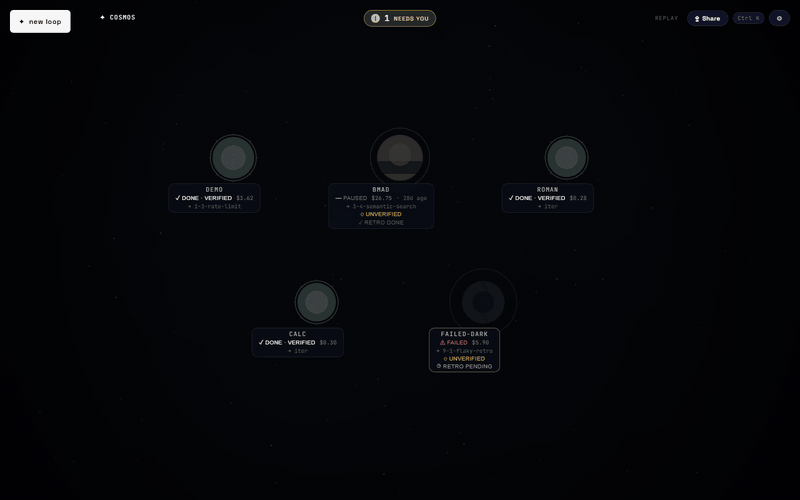
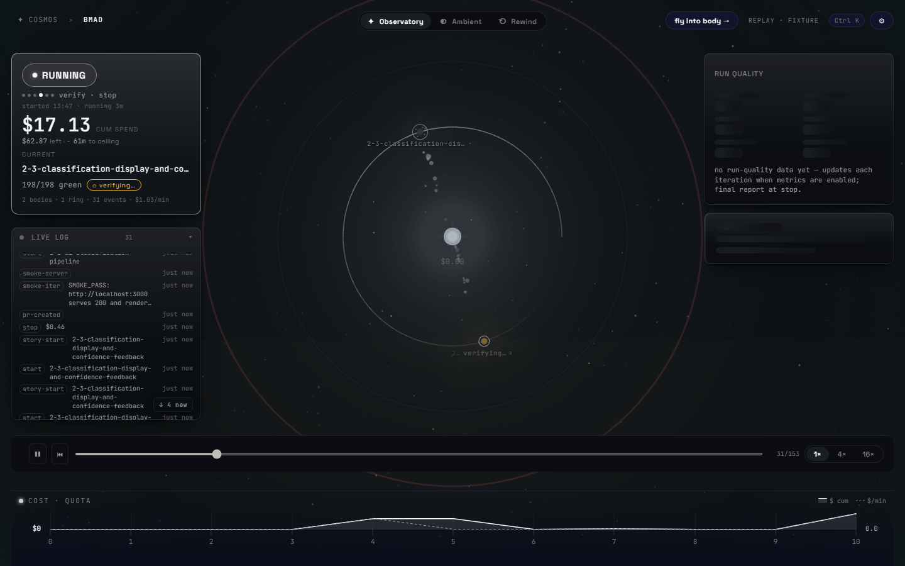
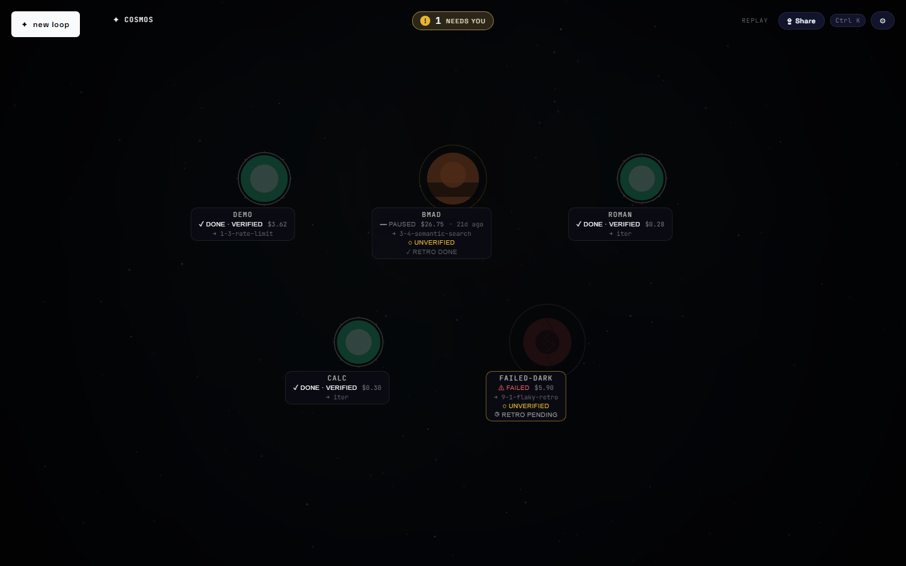
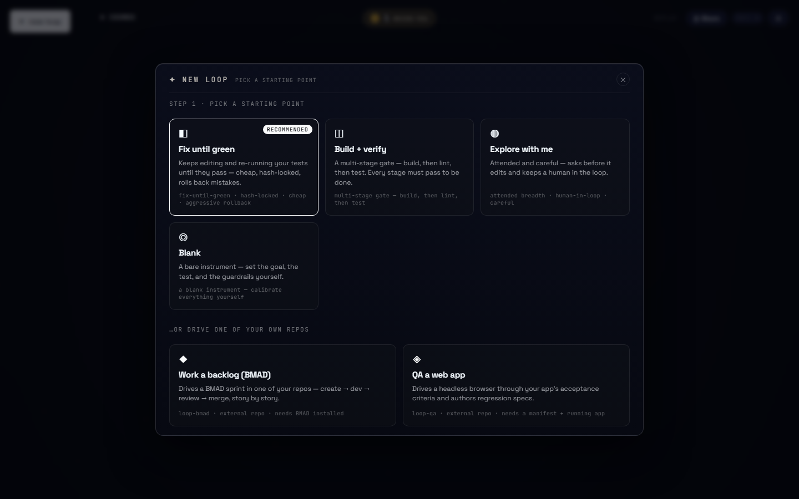
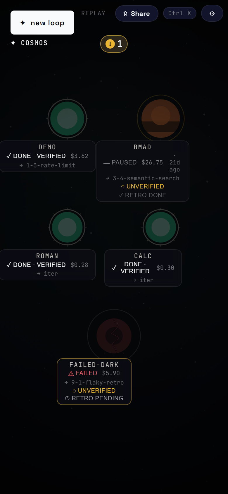
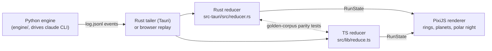

# Orrery

**Build, run, and *watch* autonomous Claude Code loops — rendered as a living orbital star system.**

[](https://github.com/NDilanka/orrery/actions/workflows/ci.yml)
[](https://github.com/NDilanka/orrery/releases)
[](LICENSE)



## What is this

Orrery is a desktop app (Tauri v2 + Svelte 5 + PixiJS) for running coding agents unattended — and actually seeing what they're doing. Its embedded Python engine drives the `claude` CLI in a guarded self-prompting loop: an external test gate is the only source of truth, every iteration is a git commit, and the run survives crashes and quota walls. The app tails the loop's event log and renders it as a star system — epics become rings, stories become planets, and a quota pause becomes polar night.

**Status: alpha.** This drives a paid CLI (`claude`) against your real repo. Read [SECURITY.md](SECURITY.md) before running anything unattended, and expect APIs and the wire protocol to change before 1.0.

| | |
|---|---|
|  |  |
|  |  |

## Install

Prebuilt bundles ship with every release — grab one from the
[latest release](https://github.com/NDilanka/orrery/releases/latest) (currently v0.4.0):

| OS | Download |
|---|---|
| **Windows** | `orrery_0.4.0_x64_en-US.msi` (or `orrery_0.4.0_x64-setup.exe`) |
| **macOS** | `orrery_0.4.0_aarch64.dmg` (Apple Silicon) · `orrery_0.4.0_x64.dmg` (Intel) |
| **Linux** | `orrery_0.4.0_amd64.AppImage` (portable) · `.deb` · `.rpm` |

> **macOS:** the builds are unsigned, so Gatekeeper will balk the first time.
> Right-click the app → **Open** (once), or clear the quarantine flag:
> `xattr -cr /Applications/orrery.app`

The installed app replays bundled fixtures with no further setup. To **ignite real
loops** from it, also install the engine so the `loop-*` commands are findable
(the app checks a `.venv` near your loops directory, then your PATH):

```bash
pip install orrery-loop
```

## Try it in 30 seconds

No Rust, no Python, no API cost — the browser build replays recorded runs:

```bash
cd orrery
npm install
npm run dev        # → http://localhost:1420
```

Needs Node 18+. You get the full UI — Cosmos, Observatory, Rewind — driven by bundled fixtures of real runs.

## Run the real thing

### Desktop app

```bash
cd orrery
npm run tauri dev      # desktop window — spawns and tails real loops
```

Requires a [Rust toolchain](https://rustup.rs) (the Tauri CLI ships as a devDependency). Or use the root launchers — **`run-orrery.bat`** (Windows) / **`run-orrery.sh`** (macOS/Linux) — which set up the Python venv and open the app.

### The engine, standalone

For a terminal-only path that does not start the desktop app, see
[`docs/headless-quickstart.md`](docs/headless-quickstart.md).

```bash
pip install orrery-loop           # from PyPI (Python ≥ 3.10; deps are just psutil + pyyaml)
# …or, working from a checkout:
pip install -e "./engine[dev]"    # [dev] adds pytest, which the example's gate runs

# dry-run the bundled example — runs the gate once, calls no agent, spends nothing:
loop --loop-json examples/hello/loop.json --cwd examples/hello --state-dir examples/hello/.loop --dry-run

# for real: add --runner claude
```

If you install into a virtualenv, activate it first so `loop` lands on your PATH (`source .venv/bin/activate`, or `.venv\Scripts\activate` on Windows). The dry-run prints a red-looking baseline (`0/2 pass green=False`) before `DryRun OK` — that's the example's deliberate bug, not a problem.

Live runs need the [`claude` CLI](https://docs.anthropic.com/en/docs/claude-code) installed and authenticated. **Be clear-eyed: a real loop spends your Claude quota or API money on every iteration.** Cost ceilings are on by default, but you set them.

## How it works



The engine appends one JSON event per line to `log.jsonl` — the wire contract is [`orrery/PROTOCOL.md`](orrery/PROTOCOL.md). The desktop app tails that file from Rust; the browser build replays recorded copies. Twin reducers (Rust and TypeScript) fold events into one `RunState`, and golden-corpus parity tests keep them in lockstep. The renderer draws the result: cost horizon, six-phase cadence, per-item gate state, quota night, verifier seal.

## The engine

[`engine/`](engine/) is a pip-installable Python package (`orrery-loop`) with five console scripts:

| Command | What it does |
|---|---|
| `loop` | the generic fix-until-green loop (one task, one external gate) |
| `loop-bmad` | multi-story BMAD epic pipeline (queue-driven applied loop) |
| `loop-qa` | AC-driven functional QA pass that judges the app headlessly and authors Playwright specs |
| `loop-supervise` | restart wrapper that survives flaky gates (thrash-guarded) |
| `loop-stop` | cooperative safe-stop via a flag file, honored at the next checkpoint |

Guardrails (details in [`engine/README.md`](engine/README.md) and [`docs/capabilities.md`](docs/capabilities.md)):

- **External test gate** — the orchestrator runs your test command and reads the exit code; regex-verified stages, never the model's self-assessment.
- **Test-integrity hash-locks** — test files are hash-locked and the test count can't silently drop; tampering triggers a handoff.
- **Held-out verify + mutation audit** — a hidden test split the agent can't overfit to, and a probe that checks the suite would notice a wrong line.
- **Cost ceilings + quota survival** — cumulative spend caps, and a quota wall pauses the run and resumes it in the next window.
- **Safe-stop checkpoints** — every iteration commits to git and writes a checkpoint; resume = re-run.
- **Timeouts + decider caps** — every agent-spawning phase has a wall-clock timeout; hung processes get their whole tree killed.

## Loops

Loops are defined by a `loop.json` ([`orrery/PROTOCOL.md`](orrery/PROTOCOL.md) §7). The app seeds three:

| Loop | Kind | What it is |
|---|---|---|
| `hello` | runnable | self-contained fix-until-green demo — a tiny Python project with a deliberate bug and a pytest gate |
| `bmad` | template | drives a [BMAD-method](https://github.com/bmad-code-org/BMAD-METHOD) project through a multi-story epic pipeline |
| `webapp-qa` | template | the AC-driven QA loop against a web app |

You rarely need to hand-write a `loop.json`: in the app, **✦ new loop** opens a recipe
gallery — four generic blueprints (Fix until green, Build + verify, Explore with me, Blank)
plus two recipes that drive one of your own repos, **Work a backlog (BMAD)** (`loop-bmad`)
and **QA a web app** (`loop-qa`). A generic loop can target any repo on disk (*where it
runs* → `--cwd`), and **✦ Create & start** ignites the new loop in one click.

`roman` and `calc` ship as replay-only fixtures for Rewind/Planetarium. The repo-root [`examples/hello/`](examples/hello/) is the engine-side copy of the same example ([walkthrough](examples/hello/README.md)). To hand-write a loop — or a whole new driver — start with [`engine/README.md`](engine/README.md) ("Writing a new loop driver") and PROTOCOL §7.

## Project layout

```
engine/          the loop engine — pip-installable Python package (orrery-loop)
orrery/          the desktop app — Tauri v2 + Svelte 5 + PixiJS
  PROTOCOL.md    the canonical wire contract (events, RunState, loop.json)
examples/hello/  runnable cross-platform example (pytest gate) ← start here
docs/            capabilities reference + the design essay
legacy/          the original PowerShell engine (reference impl; golden source)
run-orrery.bat   one-click launchers (venv setup + desktop app)
run-orrery.sh
```

Tested: 631 engine pytest tests, 236 Vitest tests, 89 Rust `#[test]`s, 9 Playwright e2e (5 smoke + 4 settings), plus 9-case golden-corpus parity between the two reducers.

## The why

This project started as a PowerShell harness (kept in [`legacy/`](legacy/) as the reference implementation) and was ported to Python. The design rationale — why an external gate beats trusting the model, why the outer loop belongs in your code, what the research says — is the essay at [`docs/loop-engineering.md`](docs/loop-engineering.md).

## Contributing, security, license

[CONTRIBUTING.md](CONTRIBUTING.md) · [SECURITY.md](SECURITY.md) · [CODE_OF_CONDUCT.md](CODE_OF_CONDUCT.md) · [CHANGELOG.md](CHANGELOG.md) · [LICENSE](LICENSE) (MIT)
